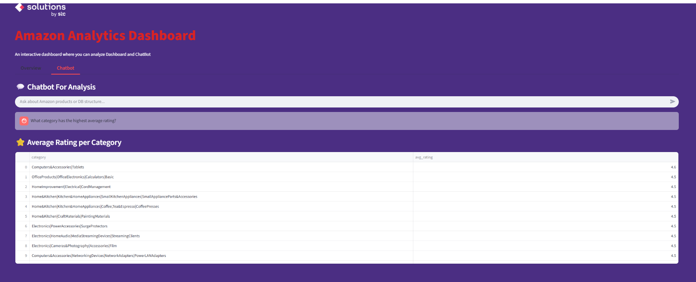
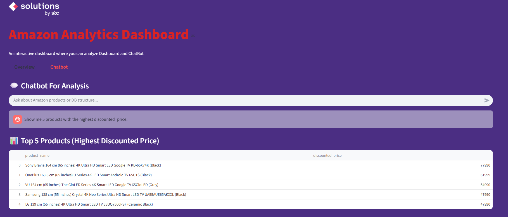
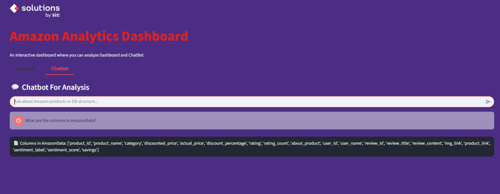
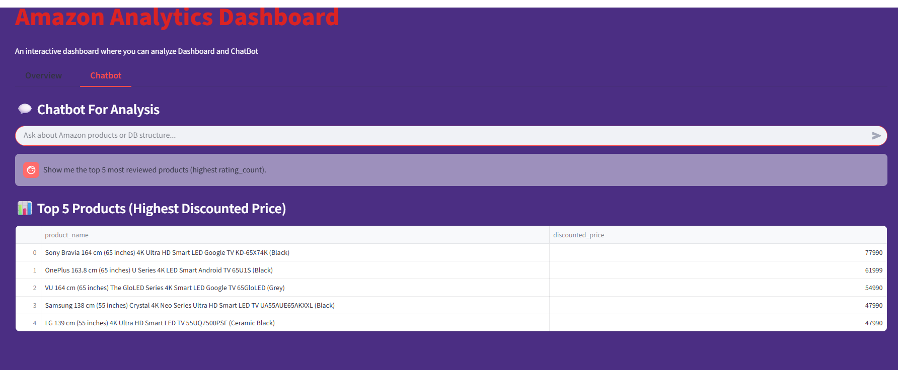

📊 Amazon Analytics Dashboard

An interactive analytics dashboard built with Streamlit, SQLite, and Groq AI.
This project lets you analyze Amazon product reviews, visualize insights, and chat with an AI assistant that uses your database (RAG-style).

📂 Project Structure
data/                             
 └── amazon_product_reviews.xlsx     # Original dataset            
 └── AmazonData.db                   # SQLite database                

Images/          
 └── Picture1.png                    # Logo

src/             
 ├── ChatBot.py                      # Streamlit app with Chatbot + Dashboard                     
 ├── add_savings_column.py           # Script to add savings column into DB                       
 ├── sentiment_batch.py              # Batch script for sentiment analysis                            
 ├── GeneralAnalysis.ipynb           # Notebook for exploration                        
 └── AmazonData.db                   # Another DB copy for testing             

Conn.ipynb                            # Connection / API test notebook                       
README.md                             # Project documentation
.env                                  # Environment variables (API keys, etc.)                   

🚀 Features

✔️ Dashboard Overview

Show products, categories, ratings, and sentiment results.

Clean purple-themed UI with styled headers.

✔️ RAG Chatbot (Groq + DB)

Ask natural language questions about products, categories, or reviews.

AI answers by looking up your AmazonData.db.

Special queries like:

"What tables are in my database?"

"What columns does AmazonData have?"

✔️ Sentiment Analysis

Preprocessed reviews labeled with sentiment_label and sentiment_score.

✔️ Feature Engineering

Added savings column (difference between actual and discounted price).

⚙️ Installation

Clone this repository:

git clone https://github.com/AhmadAlali229/amazon-product-reviews-analysis.git
cd amazon-product-reviews-analysis

Create environment and install dependencies:

conda create -n amazon_ai python=3.10 -y
conda activate amazon_ai
pip install -r requirements.txt

Set your Groq API key inside .env:

GROQ_API_KEY=your_key_here

▶️ Usage

Run the Streamlit app:

cd src
streamlit run ChatBot.py

🛠️ Tech Stack

Python (Pandas, SQLite, Streamlit, Plotly)

Groq AI (Compound model for chatbot)

SQL (Data queries, RAG integration)

📷 Screenshots
🔹 Dashboard & Chatbot – Average Rating per Category 

🔹 Chatbot Answer – Top 5 Products (Highest Discounted Price)

🔹 Database Columns Query

🔹 Highest Discounted Price

📜 License

This project is licensed under the MIT License – see the LICENSE
 file for details.